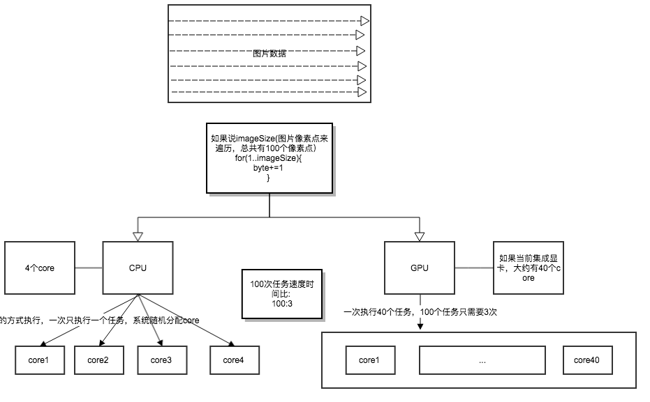
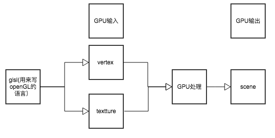
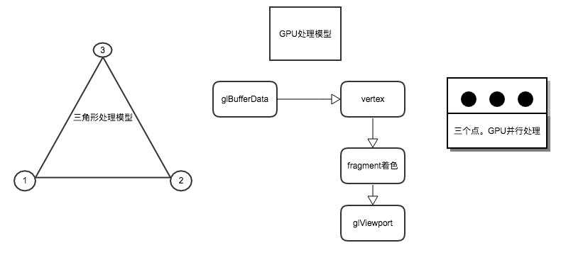
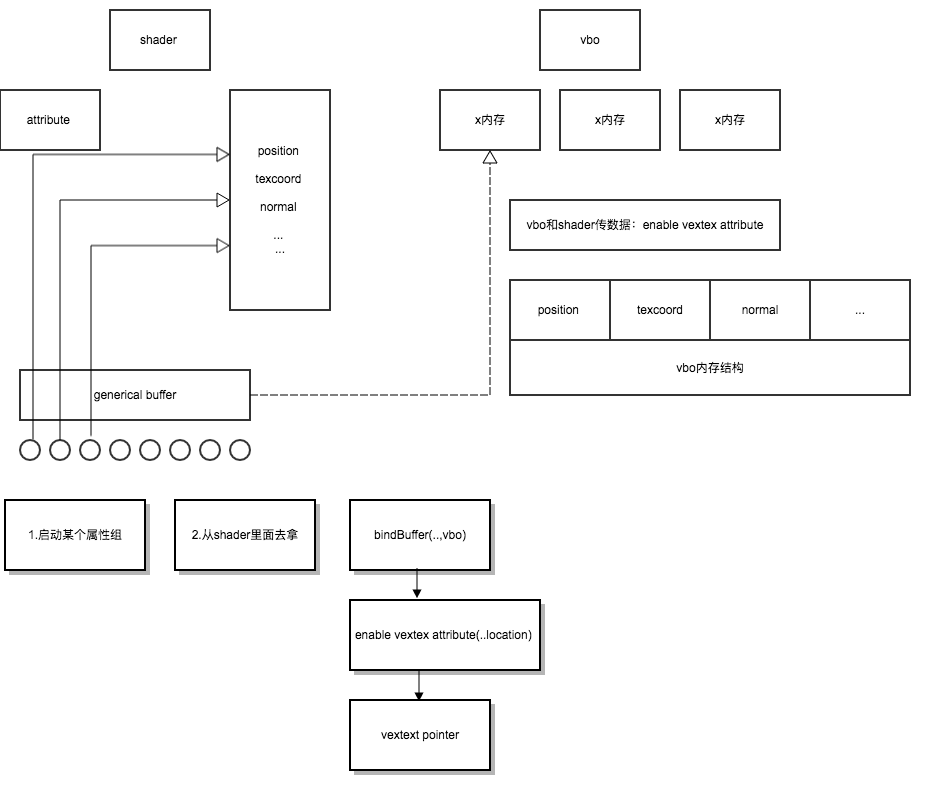

#OpenGL ES 学习入门

## 一. OpenGL ES

OpenGL_ES是khronos协会从OpenGL裁剪定制而来的，专为手机，游戏机等嵌入式设备而设计。它的接口其实和 Open GL很类似

## 二. CPU & GPU
### 1. 概念
1. CPU: 20%运算(Compute)单元 80%逻辑(Logic)单元  
2. GPU: 100%运算单元  
所以GPU的图形图像处理比CPU要快

### 2. 任务处理原理
  

### 3. GPU输入输出
  

### 4. GPU的三角形处理流程
  

## 三. VBO & Shader
--shader只负责rendering(渲染)  
--attuibute:输入， pos texcoord normal 等数据作为参数传给shader    
----通用属性组 generical buffer 2.0(存放逻辑单元，不存放数据）  
-------2.0至少有8个属性组，3.0至少有16个（2.0和3.0原理一样，只是多了一些属性)

--VBO:某一块内存,存放数据  
enable vextexAttributed:用来和shader传数据  

VBO先启动generical buffer的某个属性组，然后从Shader里面去拿，Shader知道自己和generaical buffer的对应关系  

代码流程如下：  

```objc
bindbuffer(...,vbo)
enable vextex attibuted(..location)//启动通用属性组的逻辑节点
vertext point(..)					  //

```  

  

