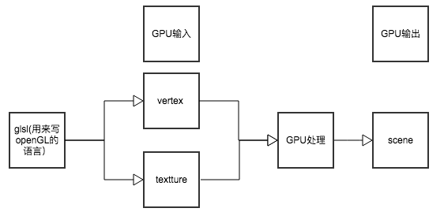
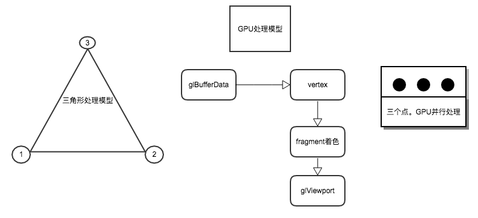

#OpenGL ES 学习入门

## 一. OpenGL ES

OpenGL_ES是khronos协会从OpenGL裁剪定制而来的，专为手机，游戏机等嵌入式设备而设计。它的接口其实和 Open GL很类似

## 二. CPU & GPU
### 1. 概念
1. CPU: 20%运算(Compute)单元 80%逻辑(Logic)单元  
2. GPU: 100%运算单元  
所以GPU的图形图像处理比CPU要快

### 2. 任务处理原理
  

### 3. GPU输入输出
  

### 4. GPU的三角形处理流程
  

## 三. VBO & Shader
--shader只负责rendering(渲染)  
--attuibute:输入， pos texcoord normal 等数据作为参数传给shader    
----通用属性组 generical buffer 2.0(存放逻辑单元，不存放数据）  
-------2.0至少有8个属性组，3.0至少有16个（2.0和3.0原理一样，只是多了一些属性)

--VBO:某一块内存,存放数据  
enable vextexAttributed:用来和shader传数据  

VBO先启动generical buffer的某个属性组，然后从Shader里面去拿，Shader知道自己和generaical buffer的对应关系  

代码流程如下：  

```objc
bindbuffer(...,vbo)
enable vextex attibuted(..location)//启动通用属性组的逻辑节点
vertext point(..)					  //

```  

  

## 四. GLSL语言内置的变量
**Vertex shader**  

```objc
attribute vec4 position;
attribute vec4 inputTextureCoordinate；
varying vec2 textureCoordinate;
void main()
{
     gl_position = position;
     textureCoordinate = inputTextureCoordinate.xy;
}
```

**Fragment shader**  

```objc
varying highp vec2 textureCoordinate; //highp属性负责变量精度，这个被加入可以提高效率
uniform sampler2D inputImageTexture; //接收一个图片的引用，当做2D的纹理，这个数据类型就是smpler2D。
void main()
{
     gl_FragColor = texture2D(inputImageTexture, textureCoordinate); //texture是GLSL（着色语言）特有的方法
}
```

#### 1. 常见的声明:  

| 英文        | 中文           | 意义  |
| ------------- |:-------------:| -----:|
| uniform     | 一致变量 | uniform变量就像是C语言里面的常量（const ），它不能被shader程序修改.如果uniform变量在vertex和fragment两者之间声明方式完全一样，则它可以在vertex和fragment共享使用。（相当于一个被vertex和fragment shader共享的全局变量）**uniform变量一般用来表示：变换矩阵，材质，光照参数和颜色等信息** |
| attribute | 顶点属性 | attribute变量是只能在vertex shader中使用的变量。（它不能在fragment shader中声明attribute变量，也不能被fragment shader中使用）.**一般用attribute变量来表示一些顶点的数据，如：顶点坐标，法线，纹理坐标，顶点颜色等。**在application中，一般用函数glBindAttribLocation（）来绑定每个attribute变量的位置，然后用函数glVertexAttribPointer（）为每个attribute变量赋值 |
| varying | 易变变量 | varying变量是vertex和fragment shader之间做数据传递用的。**一般vertex shader修改varying变量的值，然后fragment shader使用该varying变量的值。因此varying变量在vertex和fragment shader二者之间的声明必须是一致的。application不能使用此变量。** |

#### 2. 向量
| 英文   | 意义  |
| ------------- |:-------------:| 
| vec2     | 两个浮点数，适合在Fragment shader中保存X和Y坐标的情况 |
| vec3     | 三个浮点数 |
| vec4     | 四个浮点数，在图像处理中持续追踪每个像素的R,G,B,A的值 |  

#### 4. 矩阵
| 英文   | 意义  |
| ------------- |:-------------:| 
| mat2     | 2*2矩阵 |
| mat3     | 3*3矩阵 |
| mat4     | 4*4矩阵 |  

#### 4. 精度修饰符
| Qualifier   | 意义  |
| ------------- |:-------------:| 
| highp     | 高精度 |
| mediump   | 中精度 |
| lowp      | 低精度 |  
| precision | 默认精度修饰符|  

在顶点语言中有如下预定义的全局默认精度语句：  

```objc
precision highp float;
precision highp int;
precision lowp sampler2D;
precision lowp samplerCube;
```  

在片元语言中有如下预定义的全局默认精度语句：  

```objc
precision mediump int;
precision lowp sampler2D;
precision lowp samplerCube;
```

#### 6. 其他
| 英文   | 意义  | 例子 |
| ------------- |:-------------:| :-------------: |
| sampler2D     | 2D纹理,如果是1D或者3D的纹理，可以改成sampler1D和sampler3D | uniform sampler2D tex;  |
| gl_Position   | 设置顶点信息 | gl_Position =ftransform(); |
| gl_FragColor  | 设置着色器的信息 | gl_FragColor = color;  |  
| texture2D	   |texture2D函数我们可以得到一个纹素（texel）|vec4 texture2D(sampler2D, vec2);  |

个人理解:
顶点着
## Final.参考资料
1. [腾讯课程学习](https://ke.qq.com/course/list/opengl)
2. [OpenGL ES2.0 的三种变量类型（uniform，attribute和varying）](http://blog.csdn.net/jackers679/article/details/6848085)  
3. [Shader入门](http://www.jianshu.com/p/8687a040eb48)